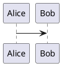

# Edge Cases

Text before the broken pieces.

## Broken diagram

```mermaid
graph LR
  this is definitely --> not(((valid mermaid
```

## Unsupported diagram format



## Unknown generator

:::generated{name="does-not-exist"}
:::

Text after the broken pieces still renders.
